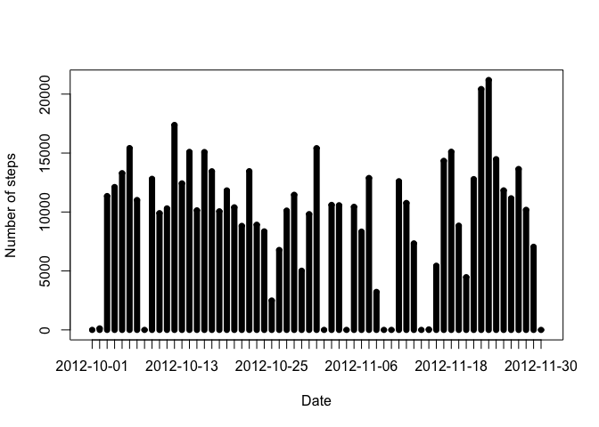
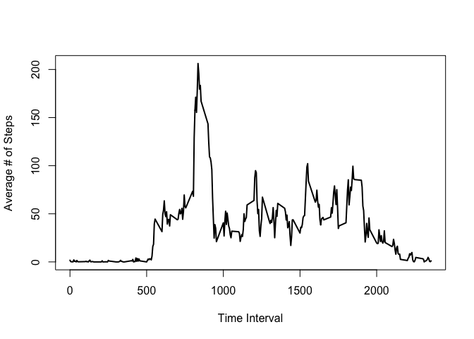
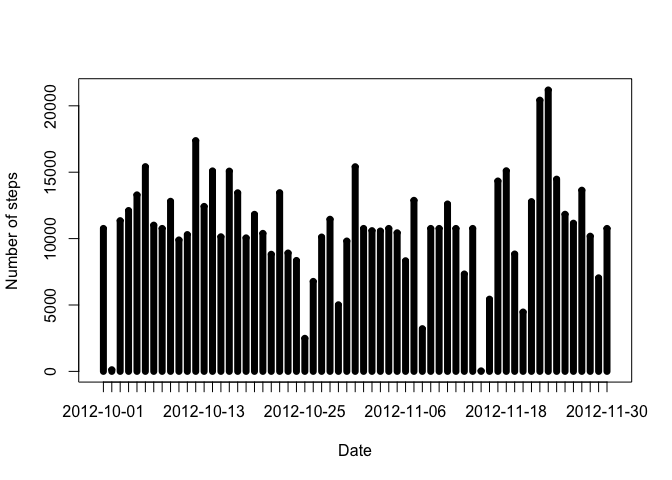
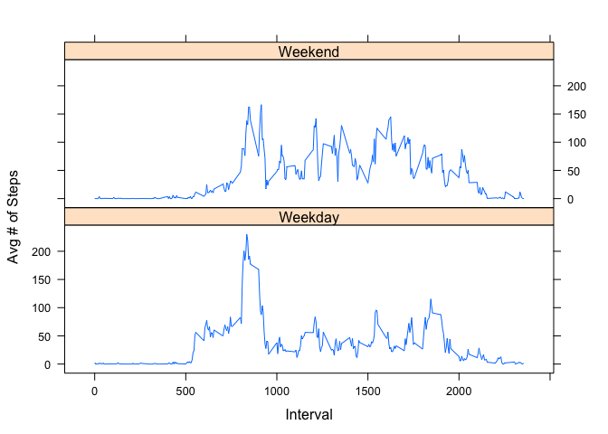

## Loading and preprocessing the data

```r
library(dplyr)
```

```
## 
## Attaching package: 'dplyr'
```

```
## The following objects are masked from 'package:stats':
## 
##     filter, lag
```

```
## The following objects are masked from 'package:base':
## 
##     intersect, setdiff, setequal, union
```

```r
library(lattice)
data=read.csv("activity.csv")
```

## What is mean total number of steps taken per day?

```r
daily=group_by(data,date)
numsteps=summarize(daily,sum(steps,na.rm=TRUE))
str(numsteps)
```

```
## Classes 'tbl_df', 'tbl' and 'data.frame':	61 obs. of  2 variables:
##  $ date                    : Factor w/ 61 levels "2012-10-01","2012-10-02",..: 1 2 3 4 5 6 7 8 9 10 ...
##  $ sum(steps, na.rm = TRUE): int  0 126 11352 12116 13294 15420 11015 0 12811 9900 ...
```

```r
summary(numsteps)
```

```
##          date    sum(steps, na.rm = TRUE)
##  2012-10-01: 1   Min.   :    0           
##  2012-10-02: 1   1st Qu.: 6778           
##  2012-10-03: 1   Median :10395           
##  2012-10-04: 1   Mean   : 9354           
##  2012-10-05: 1   3rd Qu.:12811           
##  2012-10-06: 1   Max.   :21194           
##  (Other)   :55
```

```r
plot(numsteps,type="h",xlab="Date",ylab="Number of steps")
lines(numsteps,type="h",lwd=7)
```

<!-- -->


## What is the average daily activity pattern?

```r
activity=group_by(data,interval)
avg_act=summarize(activity,mean(steps,na.rm=TRUE))
plot(avg_act,type='l',lwd=2,xlab="Time Interval",ylab="Average # of Steps")
```

<!-- -->

```r
max_steps=max(avg_act)
max_location=which.max(avg_act$`mean(steps, na.rm = TRUE)`)
max_interval=avg_act$interval[max_location]

cat("The maximum interval in the average activity is at interval",max_interval,"with a value of",max_steps)
```

```
## The maximum interval in the average activity is at interval 835 with a value of 2355
```

## Imputing missing values

```r
num_nas=sum(is.na(data$steps))
cat("There are",num_nas,"NAs in the dataset")
```

```
## There are 2304 NAs in the dataset
```

```r
where_na=which(is.na(data$steps))
intervals=data$interval[where_na]
values=0
count=1
for (i in intervals) {
  values[count]=avg_act$`mean(steps, na.rm = TRUE)`[avg_act$interval==i]
  count=count+1
}

data_impute=data
data_impute$steps[where_na]=values

daily_imputed=group_by(data_impute,date)
numsteps_imputed=summarize(daily_imputed,sum(steps,na.rm=TRUE))
str(numsteps_imputed)
```

```
## Classes 'tbl_df', 'tbl' and 'data.frame':	61 obs. of  2 variables:
##  $ date                    : Factor w/ 61 levels "2012-10-01","2012-10-02",..: 1 2 3 4 5 6 7 8 9 10 ...
##  $ sum(steps, na.rm = TRUE): num  10766 126 11352 12116 13294 ...
```

```r
summary(numsteps_imputed)
```

```
##          date    sum(steps, na.rm = TRUE)
##  2012-10-01: 1   Min.   :   41           
##  2012-10-02: 1   1st Qu.: 9819           
##  2012-10-03: 1   Median :10766           
##  2012-10-04: 1   Mean   :10766           
##  2012-10-05: 1   3rd Qu.:12811           
##  2012-10-06: 1   Max.   :21194           
##  (Other)   :55
```

```r
plot(numsteps_imputed,type="h",xlab="Date",ylab="Number of steps")
lines(numsteps_imputed,type="h",lwd=7)
```

<!-- -->

Imputing the data with the mean values raised the values of all the statistics.

## Are there differences in activity patterns between weekdays and weekends?


```r
data2=data_impute
data2$dayofweek=weekdays(as.Date(data$date))

data2$weektype=NA
for (i in 1:length(data2$steps)) {
  if (data2$dayofweek[i]=='Sunday' || data2$dayofweek[i]=='Saturday') {
    data2$weektype[i]='Weekend'
  } else {
    data2$weektype[i]='Weekday'
  }
}

weeks=group_by(data2,weektype,interval)
avg_week_act=summarize(weeks,mean(steps))

xyplot(`mean(steps)` ~ interval | weektype, data=avg_week_act,type='l',layout=c(1,2),ylab="Avg # of Steps",xlab="Interval")
```

<!-- -->
